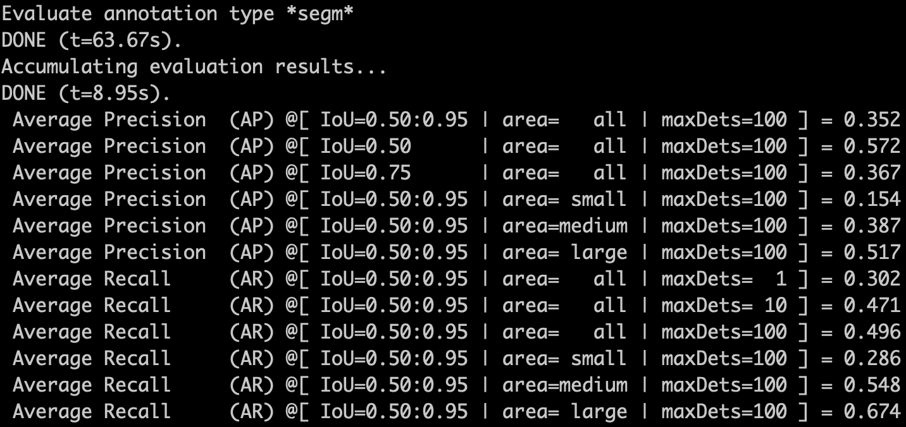

# Yolact_fcos
This repository implements [YOLACT: Real-time Instance Segmentation](https://arxiv.org/abs/1904.02689) on the [FCOS: Fully Convolutional One-Stage Object Detection](https://arxiv.org/abs/1904.01355)
detector.

## Install
The code is based on [detectron2](https://github.com/facebookresearch/detectron2). Please check [Install.md](https://github.com/facebookresearch/detectron2/blob/master/INSTALL.md) for installation instructions.

## Training 
Follows the same way as detectron2.

Single GPU:
```
python train_net.py --config-file configs/Yolact/MS_R_101_3x.yaml
```
Multi GPU(for example 8):
```
python train_net.py --num-gpus 8 --config-file configs/Yolact/MS_R_101_3x.yaml
```
Please adjust the IMS_PER_BATCH in the config file according to the GPU memory.

## Notes
Different from the original YOLACT, The repository performs instance segmentation without ROI operations or any box cropping operations, it directly obtains the masks in the whole image size.

## Inference
First replace the original detectron2 installed postprocessing.py with the [file](https://github.com/Epiphqny/Yolact_fcos/blob/master/postprocessing.py) in this repository, as the original file only suit for ROI obatined masks.
The path should be like /miniconda3/envs/py37/lib/python3.7/site-packages/detectron2/modeling/postprocessing.py

Single GPU:
```
python train_net.py --config-file configs/Yolact/MS_R_101_3x.yaml --eval-only MODEL.WEIGHTS /path/to/checkpoint_file
```
Multi GPU(for example 8):
```
python train_net.py --num-gpus 8 --config-file configs/Yolact/MS_R_101_3x.yaml --eval-only MODEL.WEIGHTS /path/to/checkpoint_file
```

## Results(model still in training,will update new result once finished)
After training - epochs on the coco dataset using the resnet-101 backbone, the mAP is 0.350 on COCO val2017 dataset:


